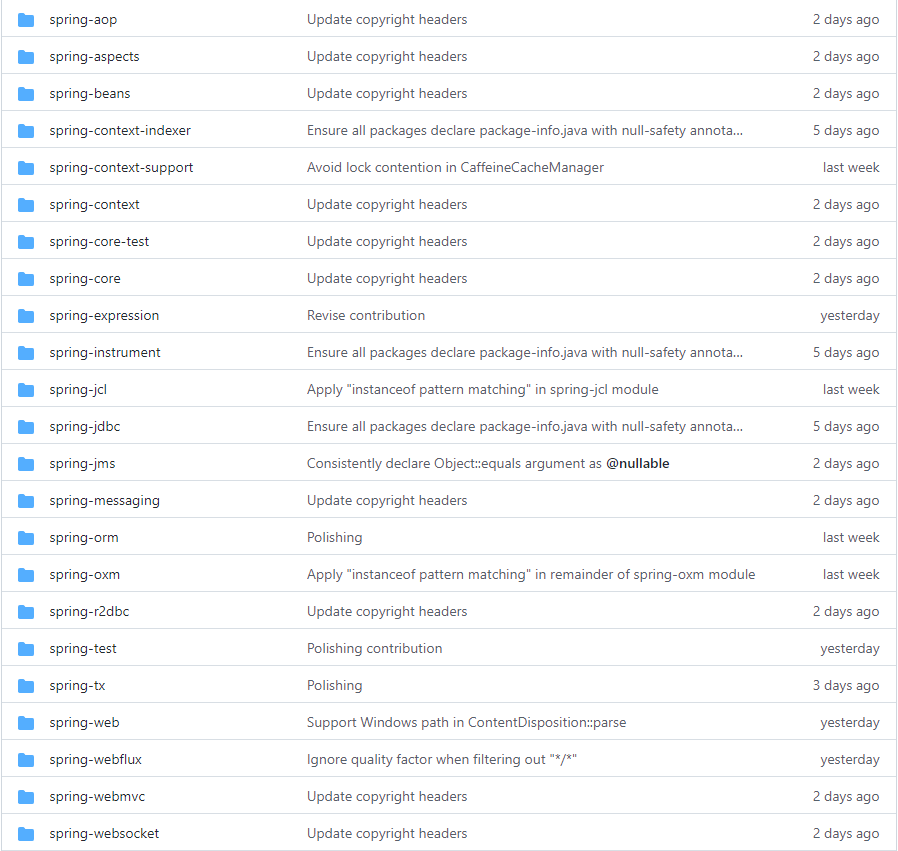

# Spring 的源码探索

## 项目背景

对于大多数第一次看Spring源码的人来说，都会不知道从哪看起，因为Spring项目源码由多个子项目组成，整个项目结构如图：

很多人一开始觉得，既然Spring是一个容器，那么应该从spring-bean看起，先了解Spring是如何从xml文件配置获取需要创建的Bean的信息，可当看到BeanFactory，FactoryBean，Environment，PropertySource等接口还是比较抽象的很难理解。

我这边推荐源码小白还是应该从`spring-web`经常用的到注解开始入手，例如：`@Controller，@RequestMapper`，
- [Servlet 详解](Servlet-Exploration/docs/Servlet.md)
- [Spring BeanFactory 详解](docs/BeanFactory.md)